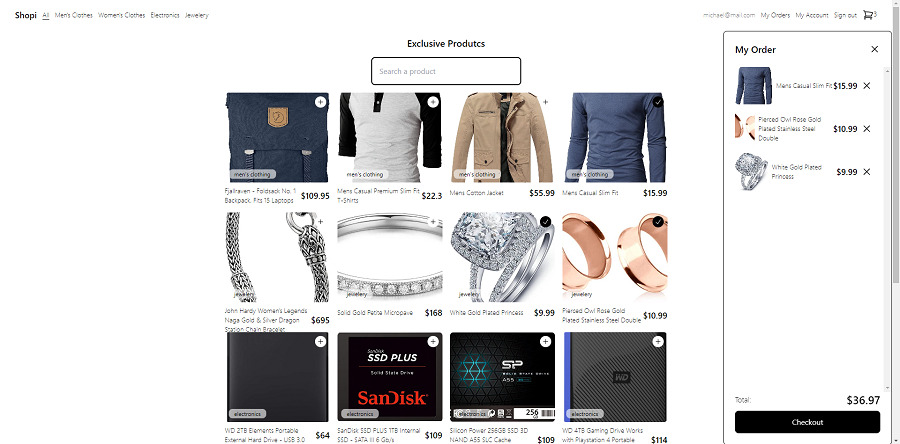
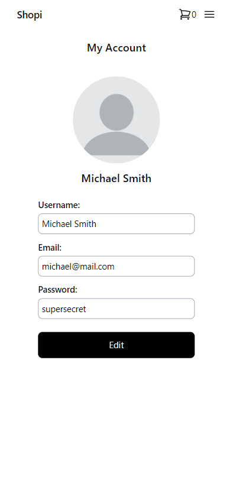
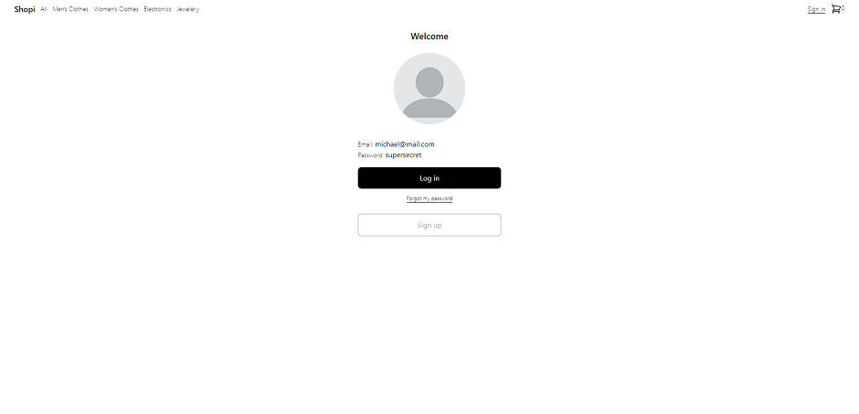

# SHOPI

Welcome to Shopi! This is an ecommerce website and it was builded with React Vite.js and the styling was done with TailwindCSS. 
This website is using a fake API and you can see all the products on it. Also it is possible to filter the products by category and by name.

You can also read the product detail of each product, add any product to the cart and checkout your purchase

## RESPONSIVE DESIGN

In this project was used TailwindCSS and of course it is responsive to any screen

## INSTRUCTIONS

First of all you have to log in in order to see all the application. If you do not have an account you should create a new account because the routes are protected. The information you write on this form will be storage in the local storage. You can type any information to create your account, you just have to create a name, email and password and after that you can see all the features of the App

## DEMO

I invite you to try all the features of this project by clicking in the following link
[Shopi](https://shopi-livid.vercel.app/)

## AVAILABLE SCRIPT

In the project directory, you can run:

### npm run dev

Runs the app in the development mode.
Open http://localhost:5173/ to view it in your browser.

The page will reload when you make changes.
You may also see any lint errors in the console.

### npm run build

Builds the app for production to the dist folder.
It correctly bundles React in production mode and optimizes the build for the best performance.

# AUTHOR

Made with 💚  by [Leonardo Salazar](https://www.linkedin.com/in/leonardo-salazar-serna/)
